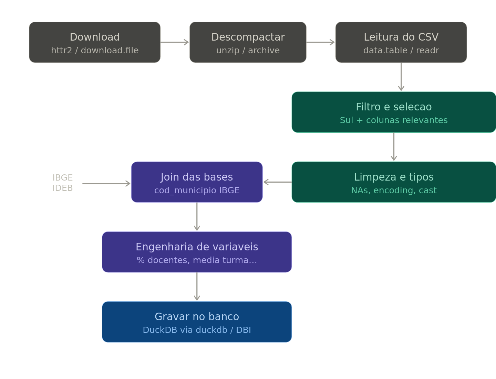

# Dados socioeconômicos e educacionais do ano de 2021 e 2022
O projeto visa realizar as coleta de dados socioeconômicos e educacionais do ano de 2021 e 2022, com o objetivo de analisar e comparar os dados entre os dois anos.

## Processamento

## Dados

Os dados foram coletados do site do IBGE, na seção de Censo Escolar. Com enfase para a região Sul do Brasil.

## Limpeza

A limpeza dos dados foi realizada utilizando o R e o armazena em um banco de dados DuckDB.
